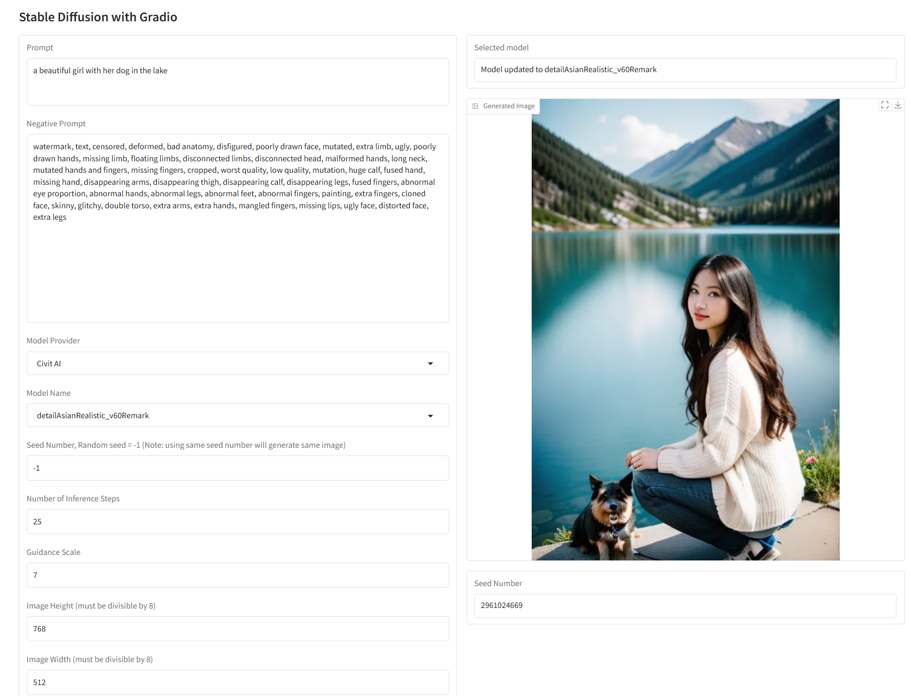
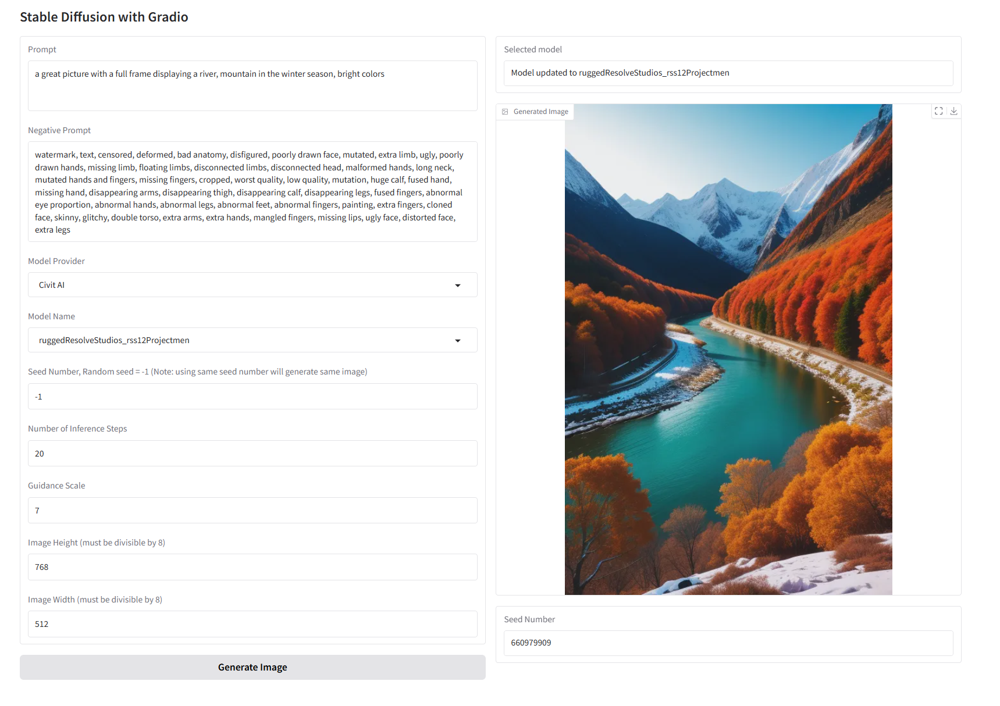

## Name
Dan Dinh

## Exercise
05-diffusion-gradio

## Prerequisites:
- Install dependencies in requirements.txt
- Add key/value pair in the .env file
    - `DIFFUSION_MODEL_PATH`: `<<Your Diffusion model path>> (e.g., "D:\SourceCode\stable-diffusion-webui\models\Stable-diffusion")`
    - `MODEL_PROVIDERS`: `<<Your list model providers>> (e.g., "Hugging Face, Civit AI, In Painting")`
    - `MODEL_HUGGING_FACE`: `<<Your list of huggingface models>> (e.g., "stablediffusionapi/anything-v5, lykon/dreamshaper-8")`
    - `MODEL_CIVIT_AI`: `<<Your list of CivitAI models>> (e.g., ="detailAsianRealistic_v60Remark, realisticVisionV60B1_v51HyperVAE, RedBlueFantasy_sd15V10, realDream_15SD15, ruggedResolveStudios_rss12Projectmen, animesh_PrunedV22")`

## Installation & How-to-test:
1. Run the exercise_5_with_diffusion_gradio.py in Terminal to test
2. Enter the prompt
3. Select parameters
4. Wait for model to be loaded before clicking image generation 

## Challenges:
None

## Screenshot or Video:
Demo with 2 prompts to generate images:

## Checklist:
- [x] I tested my code with happy case only.
- [x] I handled only main functions, skipped some of error exception handlings.