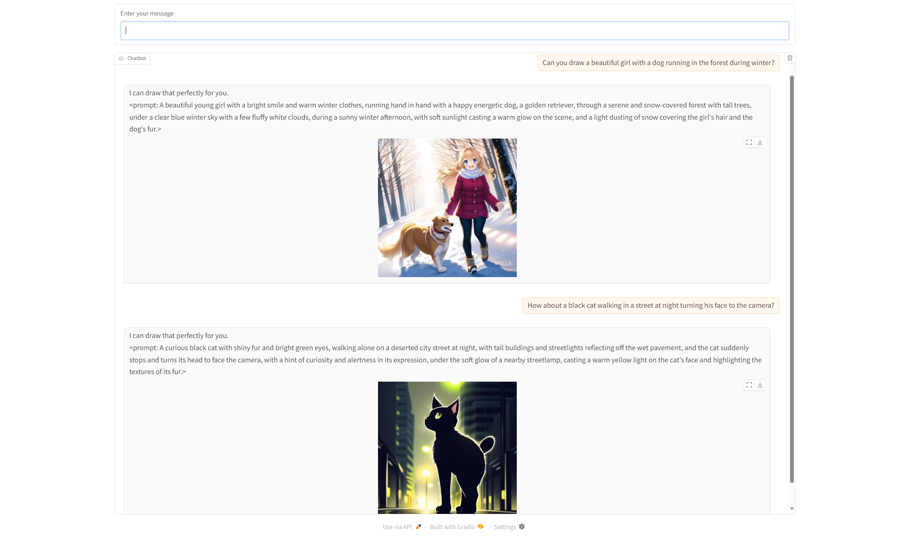

## Name
Dan Dinh

## Exercise
06-sd-webui-api

## Prerequisites:
- Install dependencies in requirements.txt
- Add key/value pair in the .env file
    - `API_KEY`: `<<Your Groq API Key>>`
    - `MODEL_NAME`: `<<Your Groq Model Name>>`
    - `WEB_URL`: `<<Your Local url for API>> (e.g., http://127.0.0.1:8080)`

## Installation & How-to-test:
1. Run the practice_diffusion_24_59b.py in Terminal to test
2. Open a new Terminal
3. Navigate to folder `./chatbot_diffusion/app`
4. Execute command line `uvicorn main:app --reload --port 8080`
5. Test the web app with a prompt like `Draw a beautiful girl in the mountain`

## Challenges:
None

## Screenshot or Video:
Demo with 2 prompts to generate images:

## Checklist:
- [x] I tested my code with happy case only.
- [x] I handled only main functions, skipped some of error exception handlings.