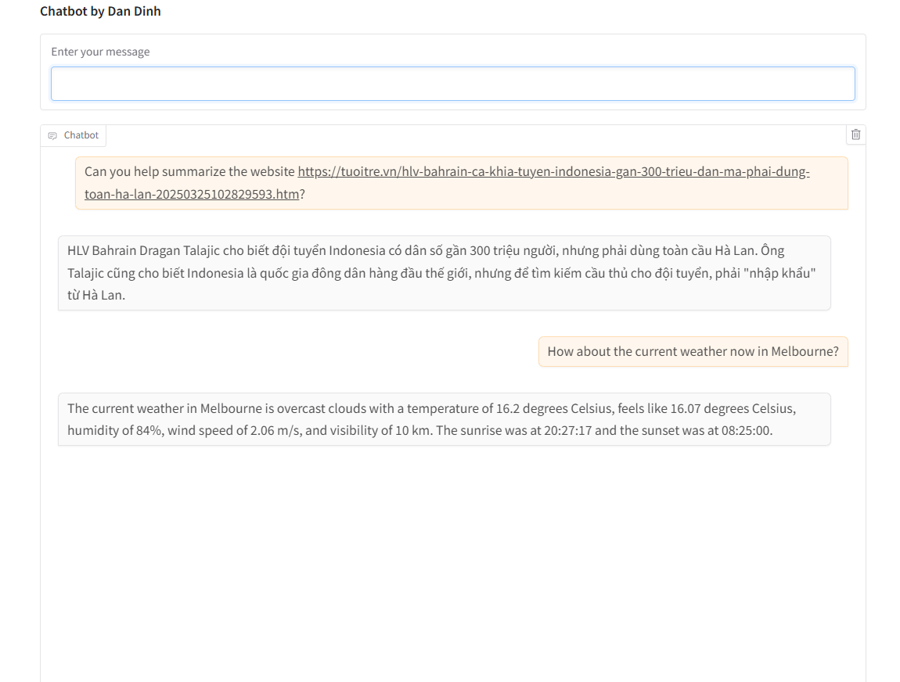

## Name
Dan Dinh

## Exercise
07-function-calling-advanced

## Prerequisites:
- Install dependencies in requirements.txt
- Add key/value pair in the .env file
    - `API_KEY`: `<<Your Groq API Key>>`
    - `MODEL_NAME`: `<<Your Groq Model Name>>`
    - `WEATHER_API_KEY`: `<<Your Weather API Key>>`
    - `JINA_API_KEY`: `<<Your Jina API Key>>`

## Installation & How-to-test:
1. Run the practice_function_calling_31_62b.py in Terminal to test
2. Test with current weather in `<<somewhere>>` (e.g., Melbourne)
3. Test with website summary like `https://tuoitre.vn/hlv-bahrain-ca-khia-tuyen-indonesia-gan-300-trieu-dan-ma-phai-dung-toan-ha-lan-20250325102829593.htm`

## Challenges:
None

## Screenshot or Video:
Demo with getting weather, and website summary:

## Checklist:
- [x] I tested my code with happy case only.
- [x] I handled only main functions, skipped some of error exception handlings.