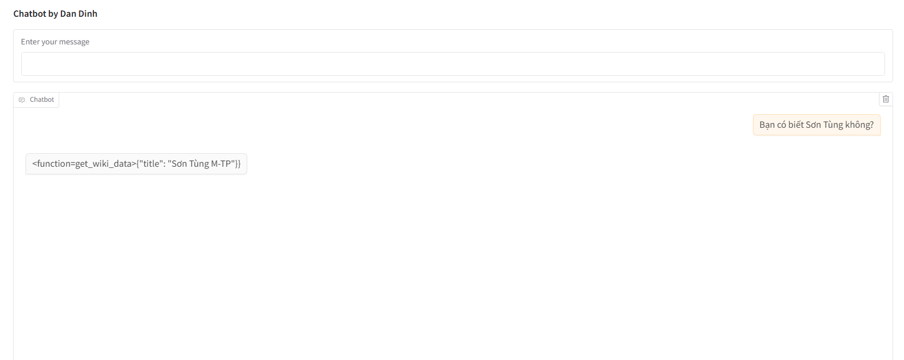
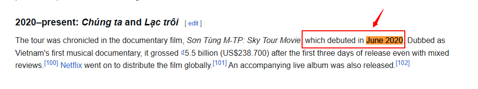
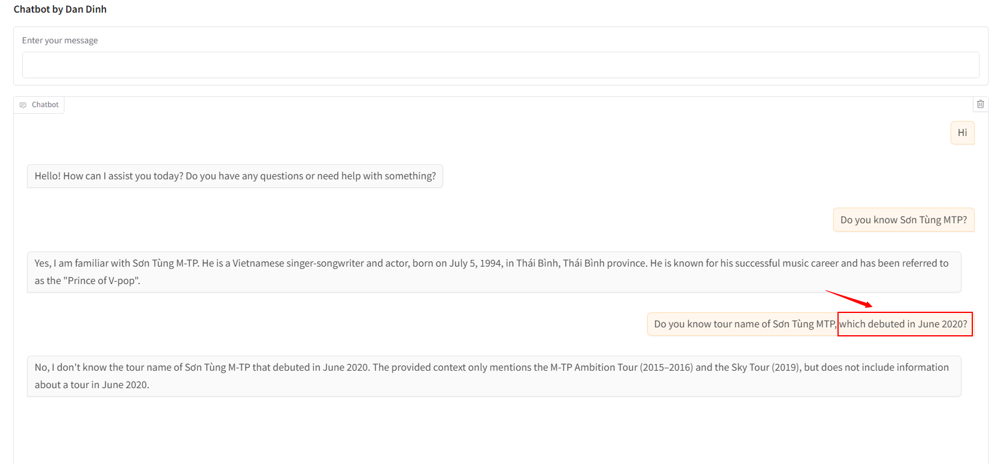
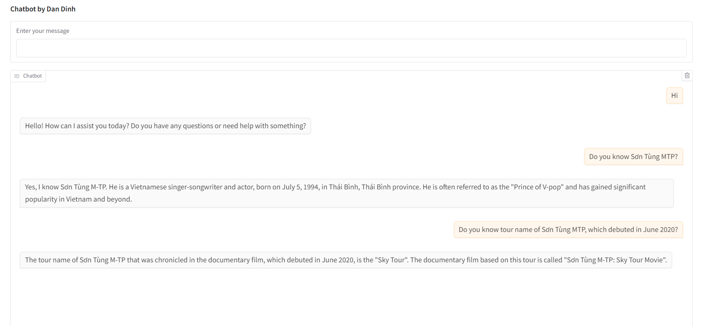

## Name
Dan Dinh

## Exercise
09-mini-rag.md

## Prerequisites:
- Install dependencies in requirements.txt

## Installation:
1. Open practice_embedding_31_69c.py
2. Update `MODEL_PATH` (The current value is `Alibaba-NLP/gte-large-en-v1.5`) for embedding model and tokenization if needed
3. Update `COLLECTION_NAME` (The current value is `practice_embedding_31_69c`) if needed
4. Get the top 3 most similar items for the search result with `n_results=3`
5. Run the practice_embedding_31_69c.py in Terminal to test

## Challenges:
1. The results sometimes return with function calling method instead of the result (e.g., `<function=get_wiki_data>{"title": "Sơn Tùng M-TP"}}`).

    Question: How to fix the problem?
    
    

2. When I tried with both default model `all-MiniLM-L6-v2` and the `Alibaba-NLP/gte-large-en-v1.5` model, search query can't get the answer for the question. It seems that in order to define the number of the top most similar items (`n_results=5` or `n_results=10`), we need to conduct multiple tests to ensure that the answer provides sufficient information based on the data stored in the database.

    Question: What do you think?

    Data input:

    

    Search result with top 3 most similar items:

    

3. I used to get the error `chromadb.errors.InvalidDimensionException: Embedding dimension 384 does not match collection dimensionality 1024`.

    It means:
    - First run:
        - The program detects that the collection "practice_embedding_31_69c" does not exist.
        - A new collection is created, and the embedding model used at that time determines its dimensionality (1024).
        - The collection metadata is stored in the database.
    - Second run:
        - The database is already present, so it does not recreate the collection.
        - The program tries to insert embeddings of a different dimension (384), which does not match the existing collection's dimensionality (1024).
        - ChromaDB enforces consistency, so the error is raised.
    - Manual Deletion Fixes It:
        - When I manually delete the database, the collection gets recreated with the new dimension (384), avoiding the mismatch.

    Question: What is the **best practice** to avoid inserting the same data again into the ChromaDB collection?

## Screenshot or Video:
Search result with top 10 most similar items:

## Checklist:
- [x] I tested my code with happy case only.
- [x] I handled only main functions, skipped some of error exception handlings.