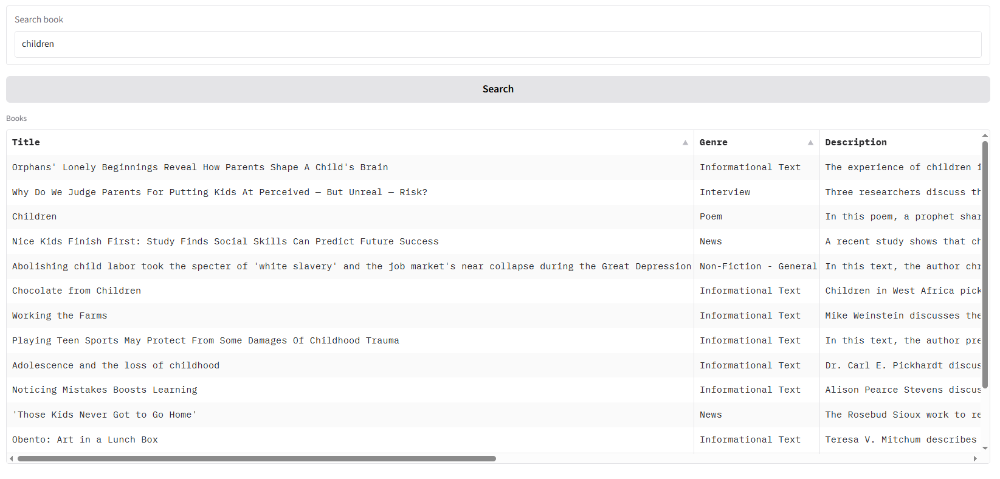

## Name
Dan Dinh

## Exercise
10-weavite-ui.md

## Prerequisites:
- Install dependencies in requirements.txt
- Setup Weaviate DB that has text2vec-transformers model

## Installation:
1. Open practice_weaviate_72b.py
2. Update `host`, `port`, `grpc_port`, and `skip_init_checks` if needed
3. Update `COLLECTION_NAME` (The current value is `BookCollection`) if needed
4. Automatically handle the CSV download process in `insert_data` method
5. Apply Hybrid search with `limit=15`
6. Output: 15 items with `Title`, `Genre`, and `Description` only
7. Run the practice_weaviate_72b.py in Terminal to test

## Screenshot or Video:

## Checklist:
- [x] I tested my code with happy case only.
- [x] I handled only main functions, skipped error exception handlings.